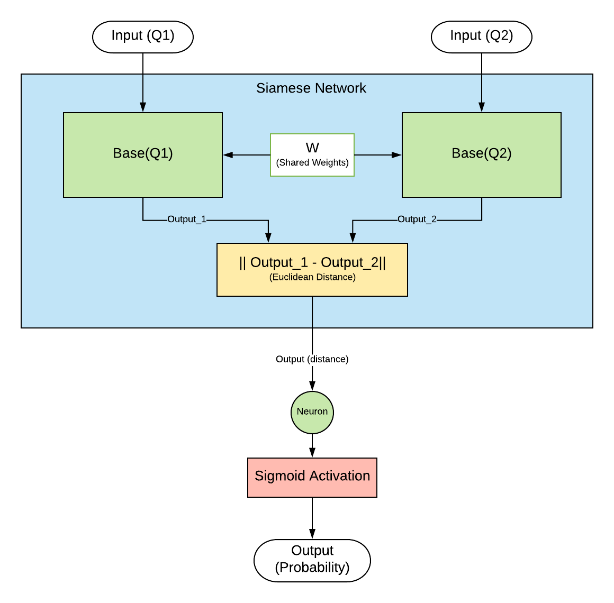
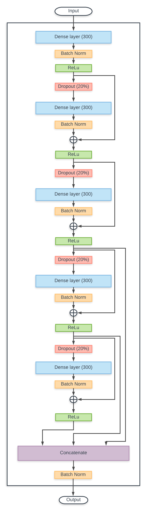

# Quora Question Pairs
This is my submission for the Quora Question Pairs problem on Kaggle. Link to the problem can be found [here](https://www.kaggle.com/c/quora-question-pairs).

## Instructions
* **ONLY** Download the Jupyter Notebook from the repository.(If you want to clone, you need to use [Git LFS](https://git-lfs.github.com/), because "submission.csv" > 50MB)
* Place it in a working directory
* In the working directory, extract the **train.csv** and **test.csv** files which can be downloaded from [here](https://www.kaggle.com/c/quora-question-pairs).
* Open the jupyter notebook. (It is recommended to use a GPU for training).
* pip install everything which is in the **import libraries** section.
* Run all the cells.

## Architecture used
A Siamese Network is used to find out the similarity between questions. The feature vector for each question is calculated using gensim's Doc2Vec implementation.

### The Siamese Network

This is a Siamese Network. The architecture of the base network is shown below.

### The Base Network (Residual NN)

------------------------------------
